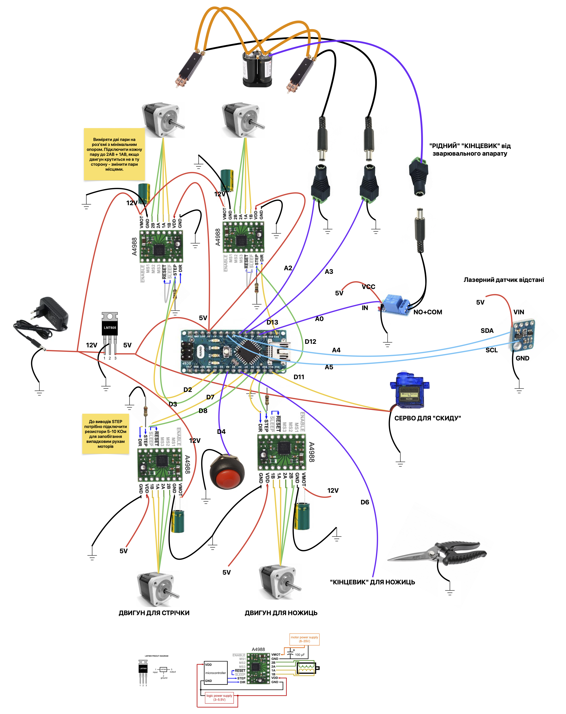

# Простий Різак для Стрічки

## Опис

Інструкція зі складання простого різака для стрічки, який використовується у виробництві батарей. Пристрій також має можливість приварювати другий шар стрічки для зварювання міді за технологією "сендвіч". У комплекті є 3D-файли для друку та код для Arduino Nano.

- Відео-презентація: *(посилання буде додано)*
- Кондуктор, згаданий у відео: *(посилання буде додано)*

## Зміст

- [Прошивка Arduino Nano](#прошивка-arduino-nano)
- [Список деталей](#список-деталей)
- [Електрична схема](#електрична-схема)
- [TODO](#todo)

## Прошивка Arduino Nano

- Встановіть бібліотеки за допомогою Менеджера бібліотек Arduino IDE:
  - Знайдіть та встановіть **AccelStepper**.
  - Знайдіть та встановіть **VL53L0X_mod**.
- Якщо функція зварювання не потрібна:
  - Змініть `bool needWelder = true;` на `bool needWelder = false;` у коді.
- Для тестування модулів окремо знайдіть `// UNCOMMENT NEEDED TEST` у коді та дотримуйтеся інструкцій.

## Список деталей

- **CNC Shield для Arduino Uno**  
  [https://vi.aliexpress.com/item/1005002807506440.html](https://vi.aliexpress.com/item/1005002807506440.html)
- **CNC Shield для Arduino Nano**  
  [https://vi.aliexpress.com/item/32834755847.html](https://vi.aliexpress.com/item/32834755847.html)
- **Кроковий двигун NEMA17 JK42HS40**  
  [https://arduino.ua/prod2962-shagovii-dvigatel-nema17-jk42hs40-1704-13a-b](https://arduino.ua/prod2962-shagovii-dvigatel-nema17-jk42hs40-1704-13a-b)  
  [https://evse.com.ua/shagovyj-dvigatel-nema17-17a-17hs4401-3d-printer](https://evse.com.ua/shagovyj-dvigatel-nema17-17a-17hs4401-3d-printer)
- **Зварювальний тримач**  
  [https://vi.aliexpress.com/item/1005006570618453.html](https://vi.aliexpress.com/item/1005006570618453.html)
- **Ножиці JTC 3422A**  
  [https://jtc.com.ua/instrument-zagalnogo-priznachennya/instrument-slyusarnij/nozhici-bagatofunkcionalni/](https://jtc.com.ua/instrument-zagalnogo-priznachennya/instrument-slyusarnij/nozhici-bagatofunkcionalni/)
- **Реле 5V 10A (низький рівень)**  
  [https://arduino.ua/prod1706-modyl-rele-5v-10a-nizkogo-yrovnya-low-level](https://arduino.ua/prod1706-modyl-rele-5v-10a-nizkogo-yrovnya-low-level)
- **Драйвер крокового двигуна StepStick A4988**  
  [https://arduino.ua/prod965-draiver-shagovogo-dvigatelya-stepstick-a4988](https://arduino.ua/prod965-draiver-shagovogo-dvigatelya-stepstick-a4988)
- **Лазерний датчик відстані GY-530 на VL53L0X**  
  [https://arduino.ua/prod2144-lazernii-datchik-rasstoyaniya-gy-530-na-vl53l0x](https://arduino.ua/prod2144-lazernii-datchik-rasstoyaniya-gy-530-na-vl53l0x)
- **Стрічка**  
  [https://vi.aliexpress.com/item/1005008182375950.html](https://vi.aliexpress.com/item/1005008182375950.html)
- **Кнопка**  
  [https://arduino.ua/prod3756-knopka-pbs-33b-bez-fiksacii-off-on-krasnaya](https://arduino.ua/prod3756-knopka-pbs-33b-bez-fiksacii-off-on-krasnaya)  
  [https://arduino.ua/prod3528-knopka-avariinoi-ostanovki](https://arduino.ua/prod3528-knopka-avariinoi-ostanovki)
- **Макетна плата**  
  [https://arduino.ua/prod361-maketnaya-plata-mb-102-830-otverstii](https://arduino.ua/prod361-maketnaya-plata-mb-102-830-otverstii)
- **Перфорована плата для паяння**  
  [https://arduino.ua/prod4130-mednaya-maketnaya-plata-diy-stripboard-iz-getinaksa-133x48-mm](https://arduino.ua/prod4130-mednaya-maketnaya-plata-diy-stripboard-iz-getinaksa-133x48-mm)
- **Arduino Nano**  
  [https://arduino.ua/prod6510-arduino-nano-v3-0-avr-atmega328p-type-c](https://arduino.ua/prod6510-arduino-nano-v3-0-avr-atmega328p-type-c)
- **Дроти**  
  [https://arduino.ua/prod195-nabor-peremichek-dlya-arduino-65-sht](https://arduino.ua/prod195-nabor-peremichek-dlya-arduino-65-sht)
- **Стабілізатор напруги LM7805 TO-220**  
  [https://arduino.ua/prod1844-stabilizator-napryajeniya-lm7805-to-220](https://arduino.ua/prod1844-stabilizator-napryajeniya-lm7805-to-220)
- **Конденсатор**  
  [https://arduino.ua/prod6477-kondensator-elektrolitichnii-jccon-47mkf-25v-lowesr](https://arduino.ua/prod6477-kondensator-elektrolitichnii-jccon-47mkf-25v-lowesr)
- **Резистори**  
  [https://arduino.ua/prod409-nabor-rezistorov-0-25w-600-sht](https://arduino.ua/prod409-nabor-rezistorov-0-25w-600-sht)
- **Серво SG90**  
  [https://arduino.ua/prod416-servoprivod-sg90-2kg](https://arduino.ua/prod416-servoprivod-sg90-2kg)

## Електрична схема

## TODO

- Оптимізувати код.
- Покращити електричну схему.
- Переробити дизайн для двигуна ножиць, він зараз уродливий.
